# CinemAI: A Machine Learning Approach for Accurate Movie Quality Prediction

## Preface

The U.S. movie industry is a thriving economic powerhouse, with its value reaching an impressive [$95.45 billion](https://www.zippia.com/advice/us-film-industry-statistics/#:~:text=The%20U.S.%20movie%20industry%20is%20worth%20%2495.45%20billion%20as%20of,4.1%25%20from%202018%20to%202025.) in 2022. Moreover, the industry is projected to maintain a Compound Annual Growth Rate (CAGR) of 4.1% from 2018 to 2025, indicating promising prospects for those working within this domain. However, this growth presents a double-edged sword. While it ensures ample job opportunities for industry employees, it also intensifies the competition among filmmakers to create captivating films that capture audience attention and satisfaction.

To comprehend the significance of predicting movie quality, let us examine a case from the past. In 2005, director Breck Eisner helmed an action-adventure film called ["Sahara"](https://en.wikipedia.org/wiki/Sahara_(2005_film)#:~:text=Sahara%20grossed%20%24119%20million%20worldwide,office%20failures%20of%20all%2Dtime.), based on Clive Cussler's bestselling novel of the same name. Despite a production cost of 160 million, the movie only managed to gross 119 million, failing to recoup its expenses. The film encountered numerous challenges, including legal disputes among the crew and violations of international laws, which substantially escalated production costs. However, the primary factor behind its lackluster performance was the lack of creativity and clear goals in its storyline. As a consequence, the movie failed to capture sufficient attention and resulted in disappointing box office returns.

Hence, predicting movie quality is important for the following reasons:

1. Audience Satisfaction: Predicting movie quality allows filmmakers, production studios, and distributors to gauge the potential reception of a movie by the audience. By identifying whether a movie is likely to be good or bad, they can make informed decisions about marketing strategies, release dates, and investment returns.

2. Financial Success: As the movie industry is a highly competitive and costly business, accurately predicting movie quality helps minimize financial risks by allowing stakeholders to invest their resources wisely. It aids in identifying potential box office successes, maximizing revenue, and minimizing losses.

3. Resource Allocation: Predicting movie quality enables better allocation of resources during the production process. Filmmakers can make adjustments, such as script revisions, casting choices, and production enhancements, to improve the overall quality of the movie based on the predictions. This helps optimize resource allocation and increases the chances of creating a well-received film.

4. Critical Reception: Movie quality predictions can also influence critical reception and industry recognition. Positive reviews and critical acclaim can enhance a movie's reputation, leading to increased exposure, award nominations, and overall industry impact. Accurate predictions allow filmmakers to target the critical reception aspect and potentially elevate the movie's stature.

5. Audience Engagement: Predicting movie quality helps in tailoring marketing and promotional campaigns to attract the target audience. By understanding the expected quality of a movie, marketers can design effective strategies to engage viewers, generate buzz, and drive ticket sales or streaming numbers.

The ability to predict movie quality holds immense significance in the movie industry. It serves as a valuable decision-making tool for stakeholders, enabling them to optimize their efforts, allocate resources wisely, and make informed investments. Ultimately, accurate predictions empower filmmakers, production studios, and distributors to deliver highly satisfying experiences to audiences while maximizing commercial success in an increasingly competitive landscape.

## Aim

The aim of this project is to leverage textural inputs to develop a predictive model that accurately assesses the quality of a movie. By utilizing machine learning techniques, the goal is to classify the forecasted movie as either a 'Good' or 'Bad' movie, providing valuable insights into its potential reception among audiences. This project seeks to empower movie enthusiasts, prospective viewers, and even filmmakers with a reliable tool to evaluate the anticipated quality of a movie based on textual information, enhancing decision-making processes and fostering a deeper understanding of cinematic excellence.

## Data

1. The data is webscrapped from [IMDB](https://www.imdb.com/).

## Project Stakeholder

1. Enthusiastic movie enthusiasts seeking deeper insights into various types of movies.
2. Curious individuals eager to determine the worthiness of an unreleased movie before watching it.
3. Movie directors aspiring to evaluate the potential success or failure of their upcoming projects.

# Data Visualization

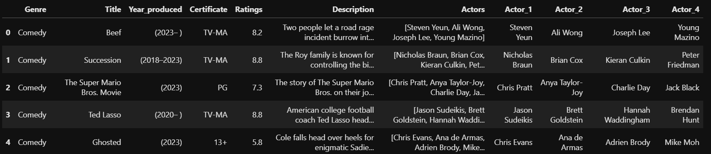

## Histogram: Plot of Ratings

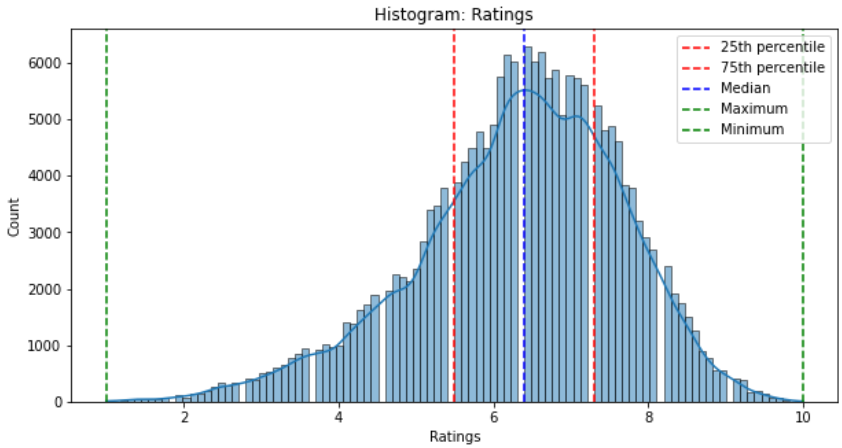

Observations:
1. This is interesting as generally, one would think that most movies have a median rating of 5. Turns out that it is observed that the median of movie ratings are located at 6.
2. This means that movies below 6 are not classified as 'good' movies according to movie reviewers.

## Countplot: Count of Movie Genres

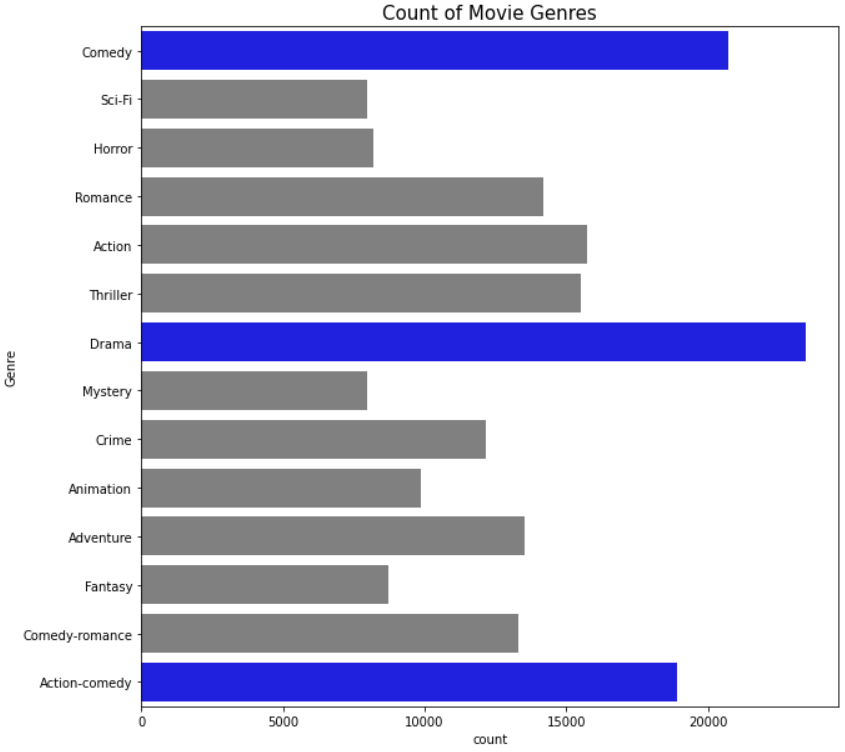

Observations
1. This count plot shows that the top 3 movie genres are Comedy, Drama and Action-comedy.
2. This shows that high number of film maker chose to produce their movie in the a/m genres. This also can be translated as high amount of audience tends towards the a/m movie genres.
3. For aspiring movie directors, this means that if they produce a movie in these 3 genres, it would target a wide audience. 

## Count plot: Count of Movie Certificates

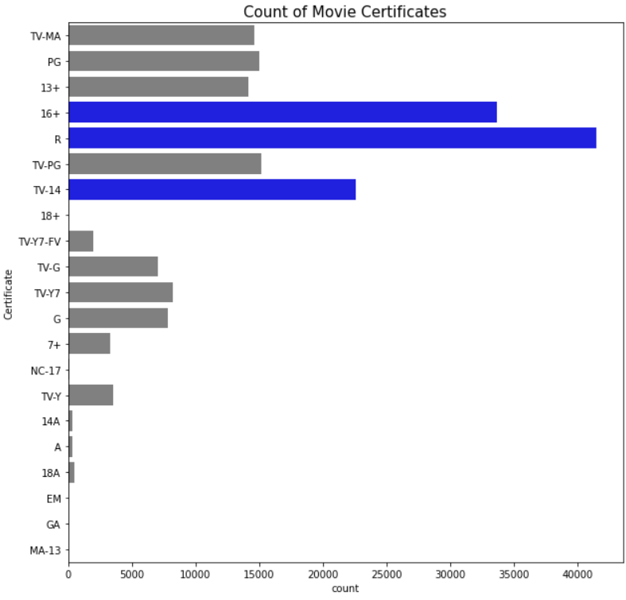

Observations:
1. It is observed that movies rated 16+, R and TV-14 are most popular.
2. Hence, movie directors can consider producing a movie rated in the a/m genres so as to hit a wide range of audience.

## Bar plot: Top Actors of All Time

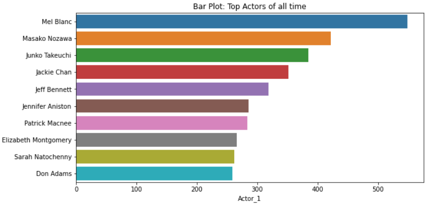

Observations:
1. From the bar plot, these are the top actors that are starred in most movies.
2. Movie directors can consider these actors as it is proof that they are starred in most movies.
3. It is noteworthy to do further investigations such as checking on these actors background as they might have retired from the industry.

## Analysing Data From Top Movie Certificate Ratings

### Histogram: R-ratings

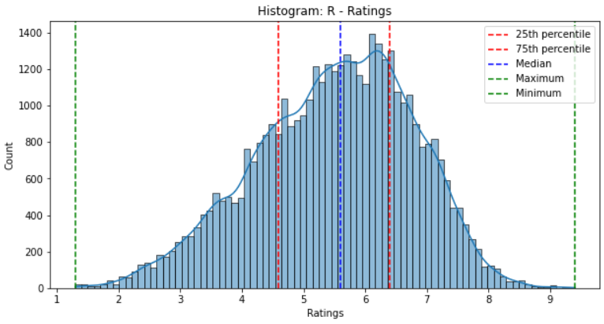

Observations:
1. It seems that the median for R-ratings are rated at 5.7.

### Histogram: 16+

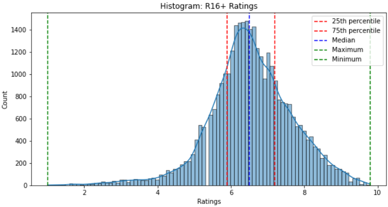

Observations:
1. It is observed that the median for 16+ rating is >6.

### Histogram: TV-14

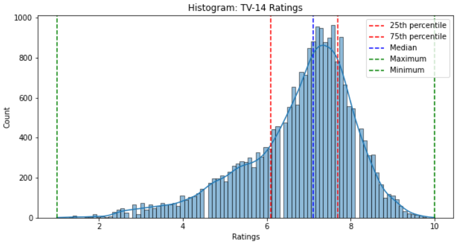

Observations:
1. It is observed that the median for TV-14 rating is >6.

### Distribution of Word Count

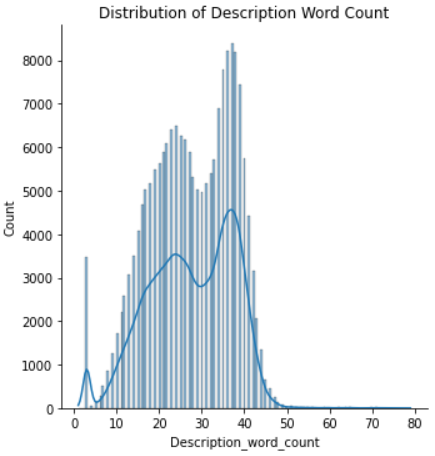

### Distribution of Description Length

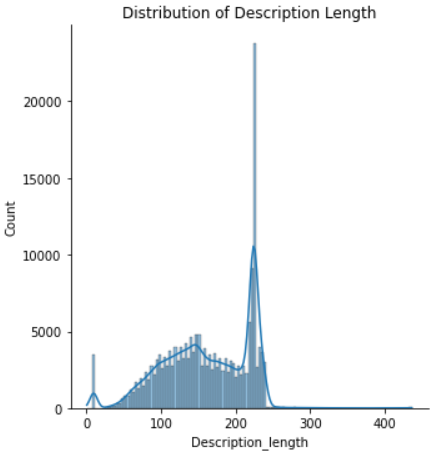

Things to note:
1. Description length refers to the total number of characters or tokens in a text
2. description word count focuses on the number of words

Observation:

1. In description length graph, it shows the total number of charavters in a text. It is observed that there is a high count of words when the description length is approx 250.
2. In distribution of word count, it shows that there are two spikes in word count. This means that most movie word count description are 20 words or 40 words. 

# Labelling Good and Bad Movies

Any movies that have a rating of ≥ 6.3 will be labelled as 'Good' whereas any movie <6.3 will be labelled as 'Bad'.

# Base Model

## Naive Bayes Model

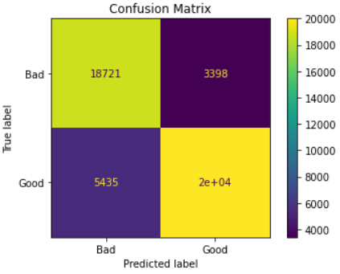

# Base Model Discussion

In analyzing the given confusion matrix, it is evident that the model performs well in terms of true positive and true negative predictions. However, the presence of a high number of false positive cases is concerning. False positives occur when the model incorrectly predicts instances as positive when they actually belong to the negative class. This can lead to potential misclassifications and incorrect decisions.

To gain a more comprehensive understanding of the model's performance, accuracy metrics are provided. The training accuracy is 87.0%, indicating that the model correctly predicts around 87% of the cases in the training set. On the other hand, the testing accuracy is 81.4%, which is slightly lower than the training accuracy. This discrepancy of approximately 6% suggests the presence of overfitting, where the model is excessively tailored to the training data and struggles to generalize well to unseen data.

To improve the model's performance, two key areas need to be addressed. First, the high number of false positive cases should be reduced. This can be achieved by adjusting the model's threshold or applying different classification techniques that are more effective in handling false positives. By reducing false positives, the model will be more accurate in identifying instances belonging to the correct class.

Second, the issue of overfitting needs to be addressed. Overfitting occurs when the model becomes too specific to the training data and fails to generalize well to new data.

The aim of model improvement is to reduce presence of overfitting and reducing number of false positive cases.

# Model Improvements

## Random Forest Classifier

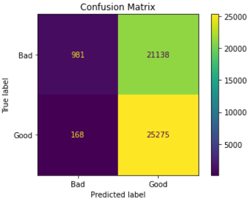

## XG Boost Classifier

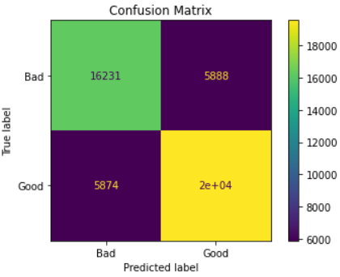

## Logistic Regression

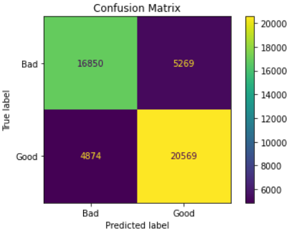

# Main Discussion

| Model                            | Train Accuracy (%) | Test Accuracy (%) | No. False Positive|
|:--------------------------------:|:------------------:|:-----------------:|:-----------------:|
| Naive Bayes (Tuned)              | 87.0               | 81.4              | 5435              |
| Random Forest Classifier (Tuned) | 55.2               | 55.2              | 168               |
| XG Boost Classifier (Tuned)      | 78.9               | 75.2              | 5874              |
| Logistic Regression (Tuned)      | 83.1               | 78.6              | 4874              |

Upon analyzing the results in the table, we observe interesting patterns in the performance of different classifiers. The Random Forest Classifier (RFC) exhibits a commendable attribute with a low number of false positive cases, standing at just 168. However, when considering the overall accuracy, both the training and testing scores are at 55.2%. While this indicates room for improvement, it also suggests that the model's predictions may not be entirely reliable, as there is a 45% chance of incorrect predictions.

Moving on to the XGBoost Classifier (XBC), we find that it demonstrates higher accuracy scores compared to the RFC. With training and testing accuracies of 78.9% and 75.2% respectively, the XGBC showcases a more consistent performance. It is worth noting that although the XGBC has a lower percentage of overfitting compared to the Naive Bayes (NB) model at 3.7%, the number of false positive cases are higher than the other classifiers.

Lastly, the Logistic Regression (LR) model shows promising results. It attains accuracy scores of 83.1% in training and 78.6% in testing. Although a 4.5% overfitting is observed, it remains relatively low, given the context of the task. Moreover, the LR model exhibits the second-lowest number of false positive cases among the classifiers considered.

Taking all these factors into account, we can conclude that the Logistic Regression (LR) model emerges as the most suitable choice for movie quality prediction. It demonstrates consistent and respectable accuracy scores, maintaining a relatively low number of false positive cases. By leveraging LR, we can expect a reliable and effective model for the task at hand.

In summary, after carefully evaluating the strengths and weaknesses of each classifier, it is evident that the Logistic Regression (LR) model emerges as the most favorable option for accurately predicting movie quality. By selecting LR as our chosen model, we have effectively reduced the overfitting percentage from 6% to a more modest 4.5%. Additionally, we have significantly decreased the number of false positive cases by 561. By making this selection, we have increase the confidence in accuracy and precision of movie quality predictions. with the implementation of LR model, we can expect more accurate and trustworthy movie quality predictions, thereby enabling us to make more informed decisions based on the model's outputs.

# Hold Out Data

Testing hold out data is to predict movies that have yet to be release. One can compare the movie prediction when the movie has been released in the future.

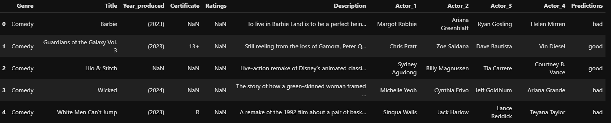

Remarks:

Based on personal experience, barbie movies are bad whereas Guardians of the Galaxy movie sequels are excellent.

# Future Works

For future works, there are several steps that can be taken to address the overfitting of the Logistic Regression model and further improve its performance and potentially exploring other types of predictions.

1. Increasing computational power: With greater computational resources, you can perform more extensive hyperparameter tuning and model training. This allows for a more thorough exploration of the hyperparameter space, leading to better-tailored models and reduced overfitting.

2. Hyperparameter tuning: Fine-tuning the hyperparameters of the Logistic Regression model can help find the optimal configuration that minimizes overfitting. Parameters such as the regularization strength (e.g., C parameter in logistic regression), penalty type (L1 or L2), and solver type can be adjusted to strike a better balance between model complexity and generalization.

3. Feature engineering and dimensionality reduction: Careful feature engineering and selection can improve the model's performance. Analyze the relevance of each feature and consider removing any that are not contributing significantly to the prediction task. This can help reduce the dimensionality of the data and potentially alleviate overfitting.

4. Exploring other models: While Logistic Regression has shown promise, it is worth exploring other types of models, such as neural networks, which are known for their ability to capture complex patterns in data. Neural networks can handle non-linear relationships and might provide improved performance compared to Logistic Regression, especially in cases of more intricate and nuanced data.

5. Other types of predictions could be explored such as genre prediction, movie certificate classification and recommendation of actors for movies.

# Conclusion

In conclusion, the objective of utilizing textual inputs to develop a model for accurately assessing the quality of movies has been successfully achieved. Among the different models evaluated, the Logistic Regression model has demonstrated its superiority and emerged as the most favorable option for this project.

By leveraging the Logistic Regression model, filmmakers and industry professionals can now make more informed decisions in various aspects, including resource allocation, critical reception, and audience engagement. The model's ability to accurately predict movie quality based on textual inputs empowers decision-makers to optimize their strategies and make well-informed choices.

This project opens up new possibilities for the film industry by providing a reliable and effective tool for assessing movie quality. The integration of textural inputs and the Logistic Regression model's predictive capabilities offer a valuable resource for filmmakers to enhance their understanding of audience preferences, improve critical reception, and optimize resource allocation.

Overall, this project demonstrates the potential of leveraging advanced machine learning techniques and textual data analysis to drive informed decision-making in the film industry. The successful implementation of the Logistic Regression model paves the way for future advancements and applications in the field, enabling continued growth and innovation in movie quality assessment and related areas.