# Currency Crystal Ball: Harnessing Machine Learning to Predict Country Currencies

## Preface

Currency, as defined by [Investopedia](https://www.investopedia.com/terms/c/currency.asp), refers to the tangible form of money in the form of paper bills and coins. It serves as a medium of exchange, accepted at face value for goods and services, as well as for savings and debt payments. But how is the value of a currency determined?

In many countries, the exchange rate of their currency is pegged to a widely used currency, such as the U.S. dollar. This practice, known as pegging, aims to maintain stability for investors. When a currency's value drops, it adversely affects the value of investments. However, while currencies are pegged for stability, it doesn't mean that their exchange rates are fixed. [Link](https://world101.cfr.org/global-era-issues/monetary-policy-and-currencies/understanding-currencies-and-exchange-rates)

In fact, most exchange rates are "floating," meaning they are constantly changing due to various economic factors. When a country's economy thrives, its currency appreciates, indicating a higher value. Conversely, when a country's economy faces challenges, its currency depreciates, resulting in a lower worth. [Link](https://world101.cfr.org/global-era-issues/monetary-policy-and-currencies/understanding-currencies-and-exchange-rates)

As a result, the prediction of a country's currency holds significant importance across various domains:

Economic planning benefits from currency prediction as it enables governments, central banks, and policymakers to devise effective strategies. This includes setting appropriate interest rates, making informed decisions regarding fiscal policies, and optimizing international trade.

Investment decisions are empowered by currency prediction, allowing investors to assess the attractiveness of opportunities in different countries. By accurately forecasting currency movements, investors can make informed choices to maximize potential returns, allocate assets effectively, and manage risks.

For tourism and travel, currency prediction plays a vital role. Travelers can plan and budget their trips effectively based on accurate forecasts, enhancing their overall travel experience by optimizing expenses.

Maintaining global financial stability is another crucial aspect. Currency fluctuations can have significant ripple effects on global financial markets and economies. Accurate prediction of currency movements aids policymakers and financial institutions in identifying potential risks, averting crises, and upholding stability within the international financial system.

By understanding and predicting country currencies, we can navigate the intricacies of the global economy, make informed decisions, and optimize outcomes across various sectors.

According to a post by [ibanfirst](https://blog.ibanfirst.com/en/which-are-the-emerging-currencies-to-watch-out-for-in-asia) The Sing dollar (SGD), chinese yuan (CNY), thai baht (THB),  are currencies that are emerging in asia.

## Aim

The aim of this project is to analyze and gain insights on currency fluctuations of SGD, CNY and THB over time. In addtion, develop an accurate prediction model to predict the SGD dollar. By leveraging historical data, economic indicators, and advanced machine learning techniques, we aim to uncover underlying patterns and factors that influence currency value. The ultimate goal is to provide stakeholders with a reliable tool for making informed decisions in economic planning, investment strategies, and risk management.

## Project workflow

1. Data visualization 
2. Base Machine Learning Modelling
3. Machine Learning Improvements
4. Discussions
5. Future Works
6. Conclusion

## Data

The data was collected from kaggle - [Dollar Vs Asian Currencies](https://www.kaggle.com/datasets/imtkaggleteam/dollar-vs-asian-currencies)

# Data Visualization

## Visualizing Moving Averages
Moving averages (MA) is used to help smooth out price data by creating a constantly updated average price. When there is a rising moving average, this indicates that there is an uptrend. vice versa, a declining moving average indicates a downtrend.

### Chinese Yuan (CNY)

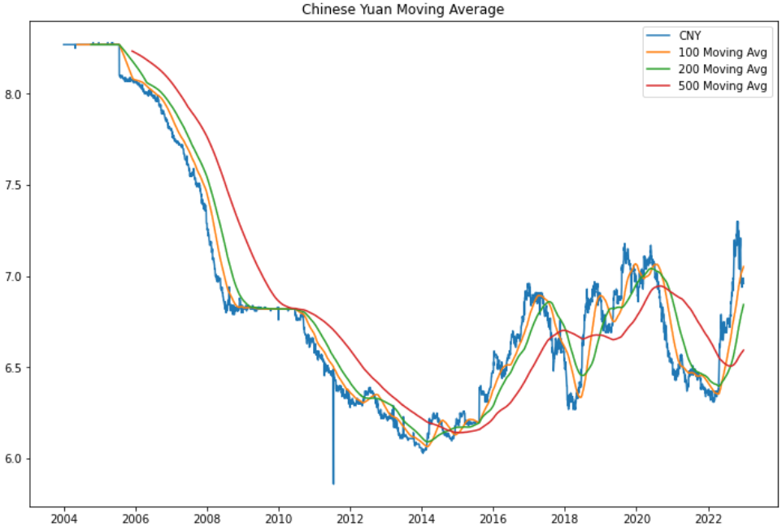

Observations:

Drawing upon the moving average of CNY, a remarkable ascent of the Chinese economy against the USD becomes evident, with a staggering growth of over 30% from 2005 to 2014. This surge can be attributed to China's widening trade surplus, which expanded from 18.5 billion in April to an impressive 35.9 billion in May. [Link](https://www.cnbc.com/2014/06/10/from-weak-to-strong-chinas-yuan-changes-track.html)

Nevertheless, a contrasting trend emerges as the CNY gradually weakens over time. This can be attributed to a series of three consecutive devaluations, resulting in a depreciation of over 3% in its value. [Link](https://www.investopedia.com/trading/chinese-devaluation-yuan/)

### Thai Baht (THB)

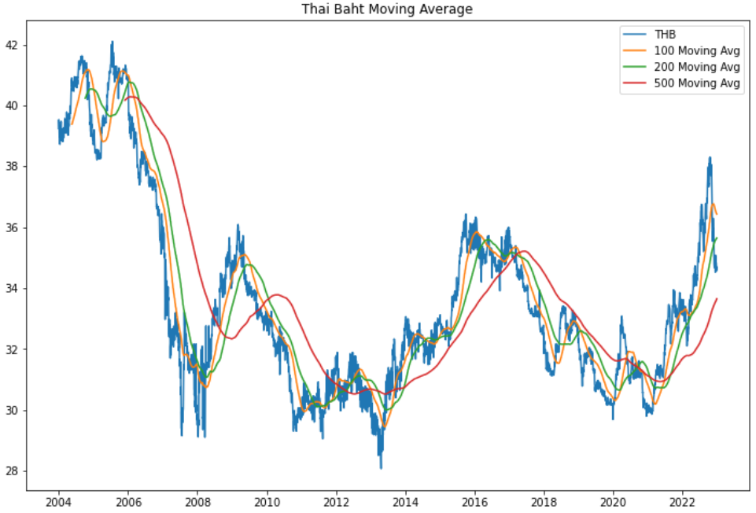

Observations:

An intriguing observation unfolds as we delve into the realm of currency fluctuations, specifically focusing on the Thai Baht (THB). Notably, the THB reached its highest appreciation in 2013, driven by Thailand's astute response to the [taper tantrum](https://www.cfr.org/blog/follow-thai-baht) that year. However, a subsequent depreciation occurred in 2015, attributed to the China scare. Moreover, recent observations indicate a renewed depreciation trend for THB starting in 2020, predominantly influenced by the [global economic downturn](https://www.voanews.com/a/thailand-welcomes-tourism-economic-progress-looks-ahead-to-2023-elections-/6908283.html) caused by the COVID-19 pandemic. Thailand, heavily reliant on tourism, experienced a notable 6% decline in its economy during 2020. Nonetheless, promising signs of recovery are now emerging as Thailand gradually rebounds from the impact of the global economic downturn.

### Singapore Dollar (SGD)

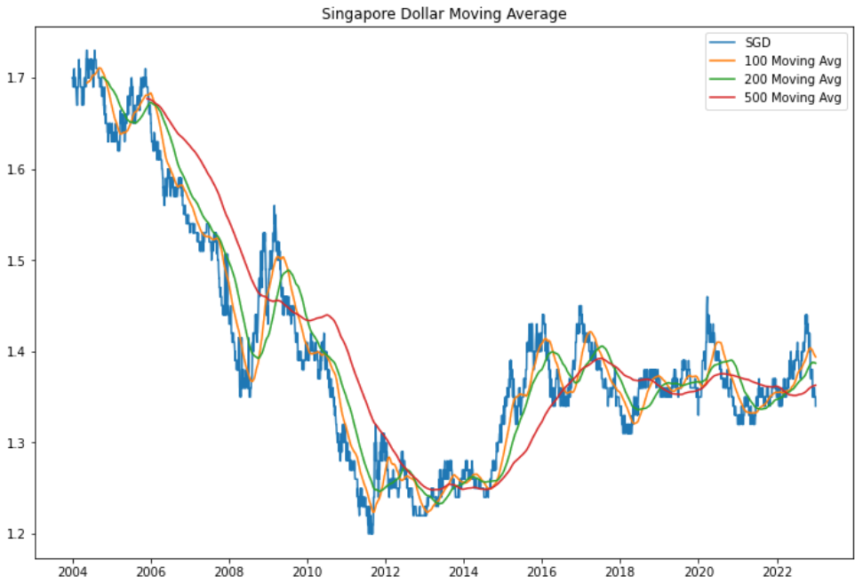

Observations:

An intriguing journey through the dynamics of currency fluctuations brings us to the Singapore Dollar (SGD), where fascinating patterns emerge. Notably, SGD soared to an all-time high in 2011, driven by the decisive actions of the Monetary Authority of Singapore (MAS). By announcing a modest revaluation of the Singapore dollar, MAS sparked a remarkable appreciation of 0.7%.

However, a shift in the tides occurred during the period of 2020-2022, witnessing a depreciation of the Singapore dollar. This depreciation can be attributed to the profound impact of the global economic downturn caused by the pandemic. Notably, tourism, which contributed approximately 4% to Singapore's domestic product in 2019 according to [Statista](https://www.statista.com/topics/5234/tourism-and-hospitality-in-singapore/#topicOverview), experienced a significant downturn, directly influencing the depreciation of the Singapore dollar.

Encouragingly, as we look beyond 2022, a captivating trend emerges: the Singapore dollar once again begins to appreciate. This trend suggests a promising recovery and underscores the resilience and adaptability of Singapore's economy amidst challenging global circumstances.

## Visualizing Resampled Annual Mean 

Resampling: Resampling is for frequency conversion and resampling of time series. Resampling is used when one needs to change the data instead of daily to monthly or weekly etc. or vice versa.

### Chinese Yuan (CNY)

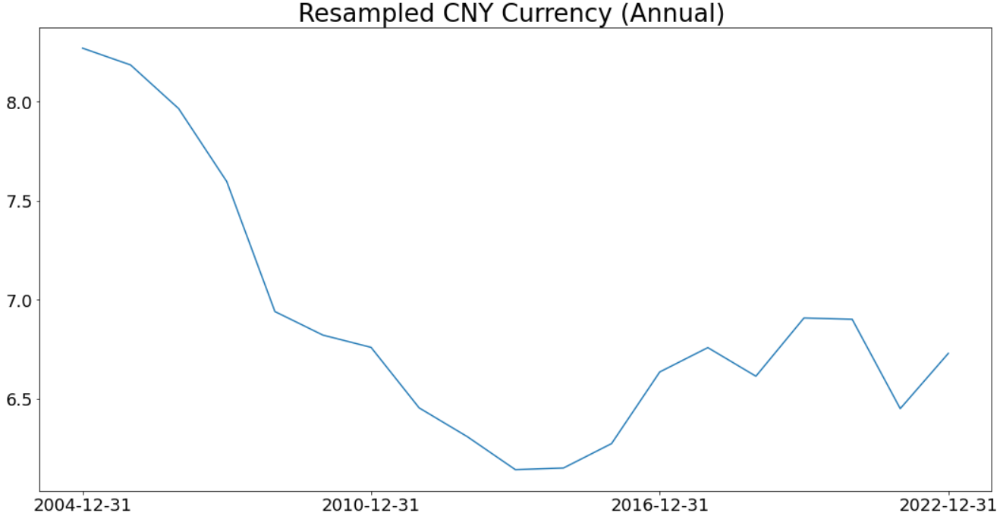

It is noteworthy to observe that the CNY currency experienced its peak performance during the years 2013-2014 when it reached an unprecedented all-time low. Over the course of subsequent years, there has been a slight depreciation, with the currency gradually moving from a value of less than 6.5 to slightly above 7.0. Despite this depreciation, it is important to acknowledge the significant strides the CNY currency has made when compared to its standing in 2004, exhibiting substantial improvements over time.

Moreover, it is worth highlighting the resilience demonstrated by the CNY currency, particularly in the face of the recent global pandemic from 2020 to 2022. Despite the challenges posed by this unprecedented crisis, the currency showcased remarkable stability and managed to avoid substantial depreciation. This noteworthy performance is a testament to the strength and adaptability of the CNY currency in navigating and withstanding the adverse effects of the pandemic, underscoring its commendable performance.

### Thai Baht (THB)

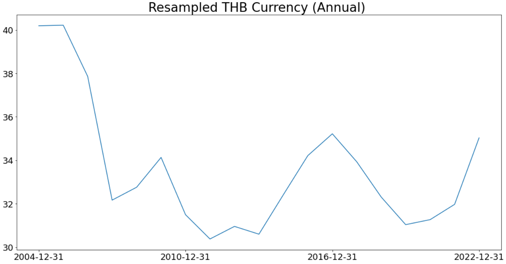

An intriguing observation emerges when examining the THB currency trends. Notably, the most substantial appreciation occurred in the years 2011-2012, showcasing a period of remarkable growth for the THB. However, it is worth mentioning that during the global pandemic from 2020 to 2022, the THB faced challenges in terms of resilience, experiencing a depreciation of nearly 5 dollars.

Furthermore, a notable characteristic of the THB currency is its tendency to exhibit fluctuations over the years when compared to the other currencies mentioned. Despite these fluctuations, it is essential to recognize the overall appreciation of the THB currency when compared to its standing in 2004. This appreciation, despite the occasional ups and downs, signifies progress and reflects the positive trajectory of the THB currency.

### Singapore Dollar (SGD)

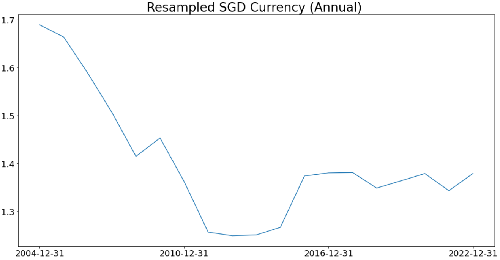

Upon examination of the data, it becomes apparent that the graph represents a resampled mean of the 'annual' SGD currency performance. Consequently, it offers a clearer depiction of how effectively the SGD currency has performed over the years. Notably, the years 2011-2014 exhibited the strongest performance for the SGD currency. Subsequently, a gradual depreciation took place over time. Nevertheless, it is noteworthy that the SGD currency demonstrated resilience in comparison to its performance in 2004, as it managed to withstand the challenges posed by the global pandemic from 2020 to 2022, signifying a notable improvement.

# Base Modelling

## Augmented Dickey-Fuller Test

To commence our analysis with the base model, it is crucial to establish the stationarity of the data. For this purpose, we employ the [Augmented Dickey-Fuller (ADF) Test](https://www.analyticsvidhya.com/blog/2021/06/statistical-tests-to-check-stationarity-in-time-series-part-1/#:~:text=The%20ADF%20test%20is%20used,the%20time%20series%20is%20stationary.), which helps us determine the presence of a unit root in the time series. In the event that the null hypothesis is rejected, it signifies that the time series exhibits stationarity.

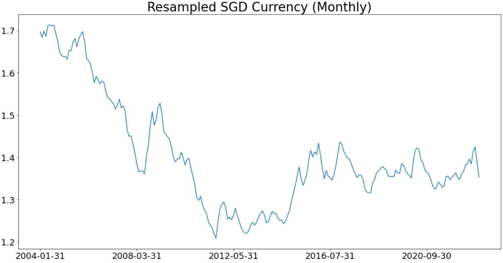

Upon careful examination of the resampled graph, it becomes evident that the data exhibits non-stationarity. This finding is further supported by the [Augmented Dickey-Fuller(AFT)](https://www.analyticsvidhya.com/blog/2021/06/statistical-tests-to-check-stationarity-in-time-series-part-1/#:~:text=The%20null%20hypothesis%20of%20the,root%20in%20the%20time%20series.) test, where the resulting value of 0.574 fails to provide sufficient evidence to reject the null hypothesis, indicating the non-stationarity of the time series.

To address this issue and ensure the reliability of our analysis, differencing techniques are employed to transform the time series into a stationary form. By implementing differencing, we aim to eliminate the non-stationary behavior, allowing for more robust and meaningful insights to be derived from the data.

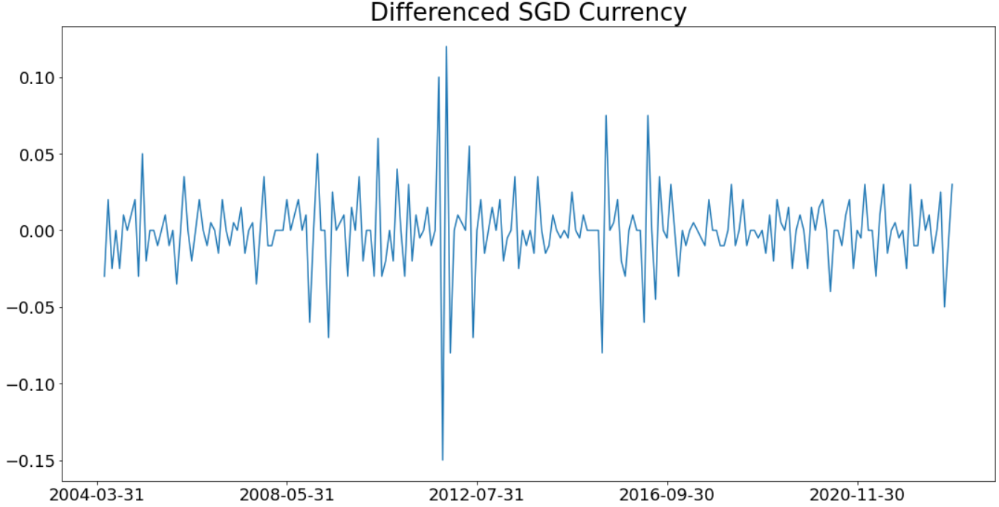

Following the application of differencing techniques, a significant improvement is observed as the time series transforms into a stationary state. This positive outcome is further supported by the results of the Augmented Dickey-Fuller (ADF) test, where the computed P value of 0.01 confidently falls below the critical threshold of 0.05. Consequently, we can decisively reject the null hypothesis, affirming the stationarity of the time series.

With this encouraging development, we can now proceed with confidence to engage in base modeling, knowing that the underlying data possesses the desirable properties necessary for accurate and meaningful analysis.

## Base Model: ARIMA

## Discussion

In the process of ARIMA base modeling, several models were fitted, and after careful evaluation, it was determined that the best model was ARIMA(2,0,3)(0,0,0)[0]. This conclusion was primarily based on the lowest AIC score of -1064.728, indicating a favorable fit of the model to the data. However, it is important to note that despite the promising AIC score, other evaluation metrics must also be taken into consideration.

Upon further analysis, it was observed that the Mean Absolute Percentage Error (MAPE) of the model is relatively high (1275338280835). This indicates that the predictions generated by the ARIMA(2,0,3)(0,0,0)[0] model may not accurately capture the true values of the test cases. Visual examination of the predicted values (depicted in green) compared to the actual test values (depicted in yellow) revealed a discrepancy, with the predictions failing to accurately capture the fluctuations and patterns exhibited by the test data.

These findings suggest that there is room for improvement in the model's predictive capabilities. To enhance the accuracy and reliability of the model, further refinements and adjustments should be made. This could involve exploring alternative model specifications, incorporating additional relevant variables, or applying more advanced modeling techniques. By addressing these areas of improvement, we can strive to enhance the predictive power of the ARIMA base model and achieve more precise forecasts.

# Model Improvements

## Autocorrelation Function

The autocorrelation ( Box and Jenkins, 1976) function can be used for the following two purposes: 
1. To detect non-randomness in data. 
2. To identify an appropriate time series model if the data are not random.

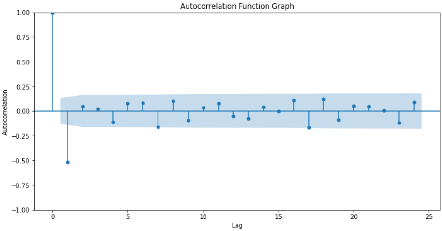

Upon careful examination of the Autocorrelation Function (ACF) graph, it becomes apparent that certain bars stand out, displaying higher values compared to others. These elevated bars signify a robust correlation between the observation and its lagged values, suggesting a stronger temporal relationship.

Moreover, the ACF graph also reveals the presence of discernible autocorrelation patterns, as indicated by the notable bars in the plot. However, it is important to note that these patterns may not be immediately obvious or easily identifiable. Therefore, a thorough analysis involving trial and error becomes necessary to unravel and understand the intricate autocorrelation patterns embedded within the data.

By engaging in this iterative process of exploration and experimentation, we can gradually uncover and interpret the underlying autocorrelation structures, enabling us to make informed decisions and select appropriate modeling techniques for time series analysis.

## SARIMA

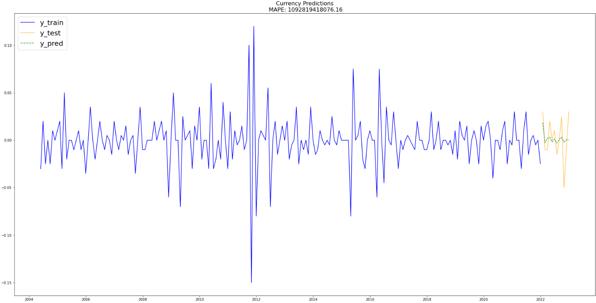

After thorough evaluation, it is evident that the optimal SARIMA model is ARIMA(2,0,1)(3,0,0)[5]. A noteworthy enhancement in the Mean Absolute Percentage Error (MAPE) score is observed, with the SARIMA model (1092819418076.16) outperforming the base model (1275338280835.62).

However, despite these improvements in the evaluation metrics, it is essential to acknowledge that the model's predictions continue to fall short in capturing the intricate fluctuation patterns exhibited by the test data. Moreover, although there has been progress in reducing the MAPE score, it remains relatively high, indicating room for further enhancements in the model's predictive capabilities.

To overcome these limitations and achieve more accurate and reliable predictions on the test data, it is crucial to explore additional avenues for improvement. This may involve fine-tuning the model parameters, considering alternative model specifications, incorporating additional relevant variables, or even exploring advanced modeling techniques. By diligently addressing these areas, we can strive to reduce the MAPE score and enhance the model's predictive performance, allowing for more precise and reliable forecasts.

## PROPHET

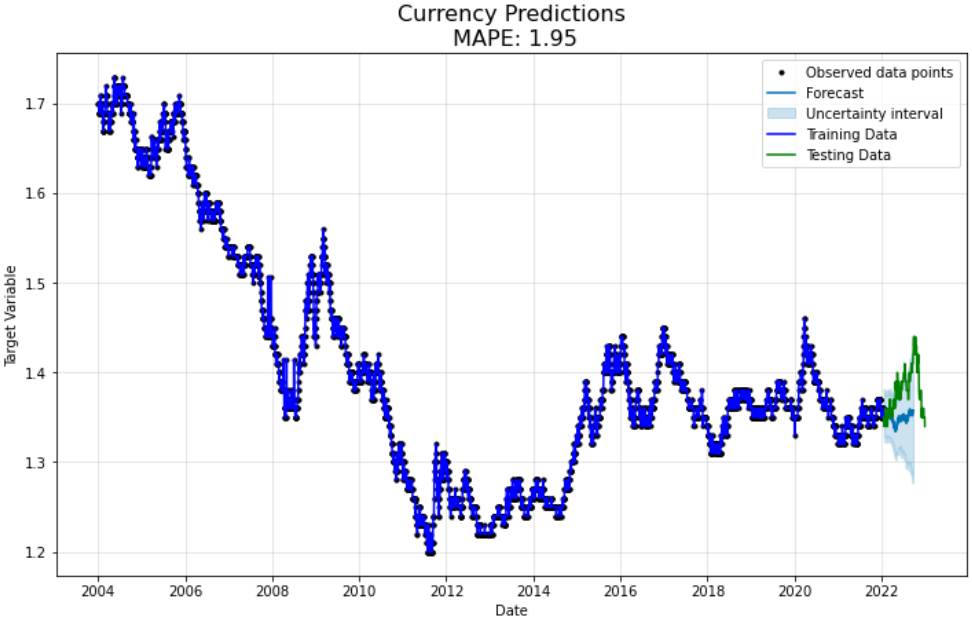

When the Prophet model was introduced, the MAPE (Mean Absolute Percentage Error) of 1.73 was way lower as compared to base model's MAPE of 1275338280835.62. This indicates that the Prophet model had a better overall accuracy in forecasting. However, upon plotting the predicted data against the test data, it became apparent that the model struggled to capture the fluctuations present in the test data.

Despite this limitation, Prophet provides a valuable feature known as the uncertainty interval. The uncertainty interval is a measure of the model's confidence in its predictions. With a 95% uncertainty interval, Prophet estimates that there is a 95% probability that the actual values will fall within the interval surrounding the forecasted values.

Taking the uncertainty intervals into account, it is observed that the majority of the test data falls within the range of the uncertainty intervals. This suggests that Prophet's predictions are accurate to a certain extent, with most of the predicted values aligning closely with the upper bound of the prediction range.

In summary, while the Prophet model may struggle to capture the full range of fluctuations in the test data, it provides valuable information through its uncertainty intervals. These intervals indicate the model's confidence in its predictions, and the test data generally aligns with the predicted range of values. Further improvements may be explored to enhance the model's ability to capture the full spectrum of fluctuations.

## SARIMAX

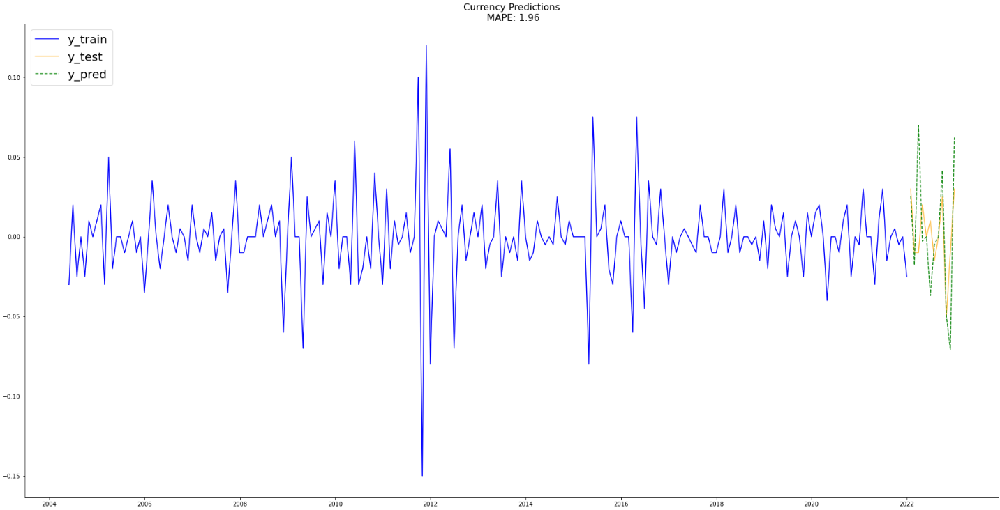

The most optimal model in SARIMAX was ARIMA(0,0,3)(0,0,0)[5]. The MAPE(1.96) was significantly lower as compared to the base model (1275338280835.6262). This improvement is reflected in the graph as shown. The predictions are able to fluctuations and patterns exhibited by the test data. On further investigations, the model might have been over estimating on certain fluctuation patterns by the test data. 

# Discussion

|   Model      |   MAPE             |   RMSE      |
|:------------:|:------------------:|:-----------:|
|   ARIMA      |   1275338280835    |   0.02032   |
|   SARIMA     |   1092819418076    |   0.0195    |
|   PROPHET    |   1.72             |   0.0408    | 
|   SARIMAX    |   1.96             |   0.0345    |

Based on the analysis, the table reveals that SARIMA achieves the lowest RMSE among the considered models. However, SARIMA's MAPE is relatively high compared to Prophet and SARIMAX. Therefore, the preferable options are Prophet and SARIMAX. Although Prophet exhibits a slightly lower MAPE compared to SARIMAX, the visual inspection of the prediction versus test data graphs indicates that SARIMAX effectively captures the intricate fluctuation patterns displayed by the test data. Consequently, SARIMAX emerges as the preferred model for accurate predictions of SGD's currency.

# Future Works

Moving forward, there are several future works that can be undertaken in the field of forecasting SGD currency. One important area of focus would be to expand the dataset by web scraping additional data from 2023 onwards. This would ensure that the model has access to the most up-to-date information for accurate predictions. While SARIMAX has been identified as the preferred model for SGD currency prediction, there is still room for improvement. The model currently tends to slightly overestimate the data, so efforts can be directed towards refining the model to enhance its predictive capabilities. Furthermore, it would be worthwhile to explore other time series models such as Exponential Smoothing, Vector Autoregression, Gaussian Process Regression, among others. By investigating and comparing the performance of these alternative models, we can gain a deeper understanding of their strengths and weaknesses and potentially identify a more accurate and robust forecasting approach for SGD currency.

## Conclusion

In conclusion, this project has successfully analyzed and provided valuable insights into the currency fluctuations of SGD, CNY, and THB. Moreover, a robust predictive model based on SARIMAX has been developed, enabling stakeholders to make informed decisions in various domains including economic planning, risk management, and investment strategies. The availability of accurate and timely predictive data empowers stakeholders to navigate the complexities of the currency market with greater confidence. However, it is important to acknowledge that the effectiveness of the model may diminish over time due to evolving market dynamics. Therefore, it is crucial to regularly update the model to ensure its relevance and reliability in capturing the changing patterns and trends of SGD currency and various factors that affects the currency. By continuously refining and updating the model, stakeholders can stay ahead of the curve and make more accurate predictions for informed decision-making in the future.