# HDB Resale House Price Prediction

## Preface
The issue of home affordability in Singapore has become increasingly prevalent in recent years. As highlighted in a recent article published by [The Straits Time](https://www.straitstimes.com/singapore/housing/hdb-resale-prices-rise-09-in-q1-smallest-increase-in-last-10-quarters#:~:text=In%20recent%20years%2C%20the%20issue,the%20private%20residential%20property%20market.), the resale prices of Housing and Development Board (HDB) flats have risen significantly by 31.9 percent over the past 12 quarters, surpassing the 27.9 percent increase observed in the private residential property market during the same period. Furthermore, the escalating costs and lengthy waiting [time](https://www.straitstimes.com/singapore/housing/bto-flat-waiting-times-between-4-and-5-years-even-with-covid-19-delays-desmond-lee) for Build-To-Order (BTO) flats have dissuaded numerous newlywed couples from purchasing them, leading to a surge in demand for HDB resale flats. Against this backdrop, the prediction of HDB resale house prices serves as a valuable tool to assist both buyers and sellers in making informed decisions.

## Project Stakeholder

1. Singapore public who need information related to resale HDB flats from 1990 to 2023.
2. Singaporean/permanent residence/foreigner who wants to buy resale HDB flats and needs early information related to resale HDB flats prices from 1990 to 2023.
3. Anyone who has interested in resale HDB flats prices from 1990 to 2023.
4. Any sellers that wants to check on their current HDB flat prices from 2023 onwards to sell.
5. Any buyers that wants to check on their current HDB flat prices from 2023 onwards to buy.

## Objective

The objective is to provide a clear and concise overview of the issue of home affordability in Singapore, particularly with regards to the rising resale prices of HDB flats and the challenges faced by newlywed couples in purchasing a home. This project aims to establish the significance of predicting HDB resale house prices as a means to aid both buyers and sellers in making informed decisions.

## Datasets

The dataset has been taken from Government official site. [Link](https://data.gov.sg/dataset/resale-flat-prices)

## Summary of Data Cleaning
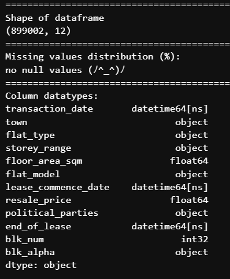

In summary, there are 899,002 rows and 12 columns after feature engineering. The respective data types have been corrected and there are 0 null values. 

## Data Visualisation

The image below shows the top 5 rows of the dataframe after data cleaning and feature engineering.

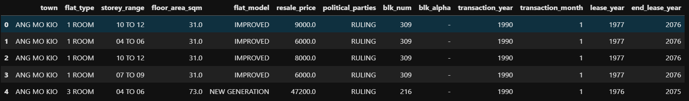

### Correlation Matrix

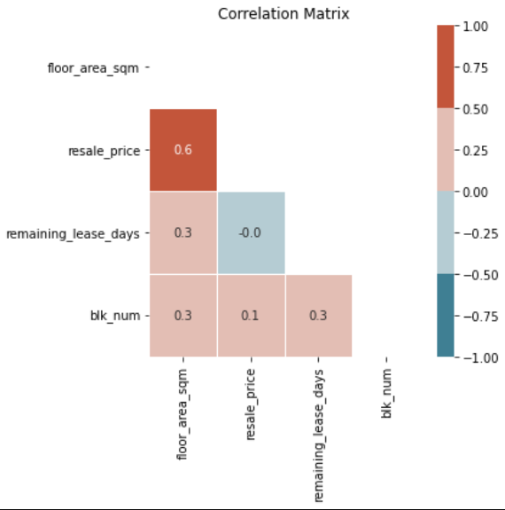

Correlation matrix observations:

| S/n | Observations | 
| -------- | -------- | 
| 1 | +ve correlation between resale_price to floor_area_sqm | 

More graph visualisations must been done to further understand this dataset.

### Describing Dataset

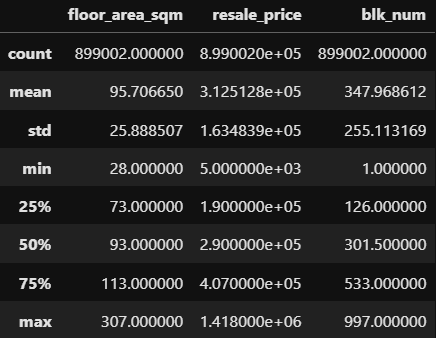

Remarks: 
1. This shows the standard statistics of dataframe
2. notable features are, resale the mean of resale prices of hdbs are 300k+

## Graph visualization

### Histogram: Resale Price

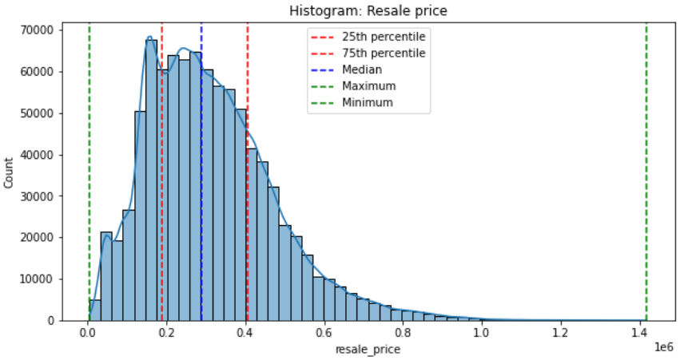

Remarks:

1. This shows the histogram of resale price that is slightly skewed to the left.
2. It is observed that majority of houses are sold in 300k range.
3. The highest is sold for ~1.4 million where as the lowest is sold for <100k.
4. 25% of houses are sold around 250k and 75% of houses are sold around 400k

### Histogram: Demand of Resale Houses Over Time

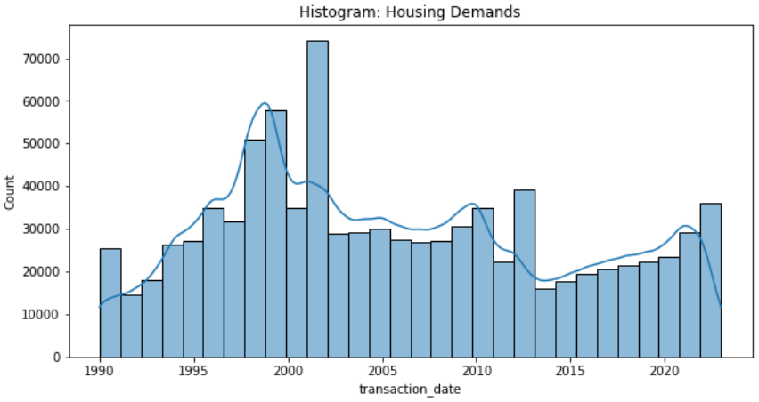

Observations:
1. There is a spike in 1995-1999. This is due to HDB announcing that singles above 35 years old are eligible to purchase HDB resale flats but limited to 3 room flats at selected location. [link](https://www.todayonline.com/singapore/timeline-singapores-public-housing-policy-singles)
2. It is observed that there is a another spike in housing demands from 2000-2004. This is due to the new policy from the HDB in 2001: Singles are now allowed to buy HDB resale 3 room flats in central areas. And in 2004: Singles are allowed to purchase 4-5 room flats in any location. [link](https://www.todayonline.com/singapore/timeline-singapores-public-housing-policy-singles)

### Lineplot: Resale Houses Prices Over Time

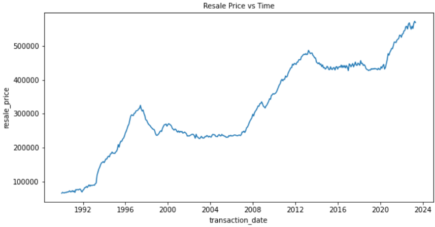

Observations:

It is observed that there prices of houses are consistently rising over the years. This could be due to the following reasons:
1. There is an overall increase in prices of private properties, which leads to an increase in demand for HDB resale flats. [link](https://www.redbrick.sg/blog/top-5-reasons-behind-the-rise-in-hdb-resale-prices/)
2. Low interest rates of resale flats. Singapore Overnight Rate Average (SORA), the rate most bank uses for bank loan has dropped from 0.3%(in 2020) to 0.16%(2021). This encourages buyers to purchase properties at a lower cost of borrowing and leveraging. Though interest rates may fluctuate, this incentivized many to enter the resale market with prospects of decreasing morgage repayments in the long run.[link](https://www.redbrick.sg/blog/top-5-reasons-behind-the-rise-in-hdb-resale-prices/)
3. Price stability of HDBs. As a large population of Singapore's population resides in HDBs, it is not a surprise that the public housing is seen as a necessity in Singapore. This translates to, even with poor econimic outlook, the demand for HDB resale flats is unlikely to be shaken. [link](https://www.redbrick.sg/blog/top-5-reasons-behind-the-rise-in-hdb-resale-prices/)

### Countplot: Count Of Houses In Various Towns 

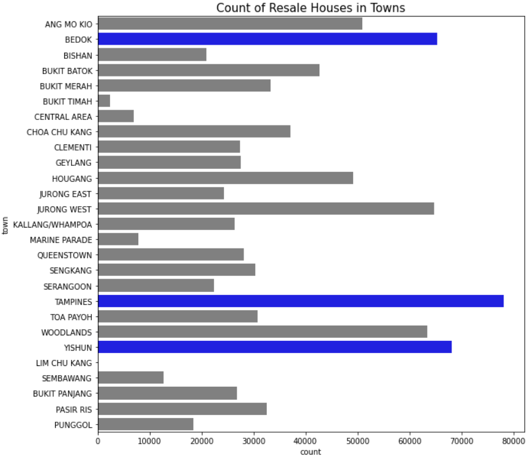

Observations:

1. This count plot shows the resale housing in certain towns. Right off the bat, Tampines, bedok, woodlands and yishun have one of the highest counts in resale.
2. Whereas Lim Chu Kang is the lowest in count for resale housing.
3. This also indicates that there is high population of people living in these areas.

### Lineplot: Floor Area Over Time

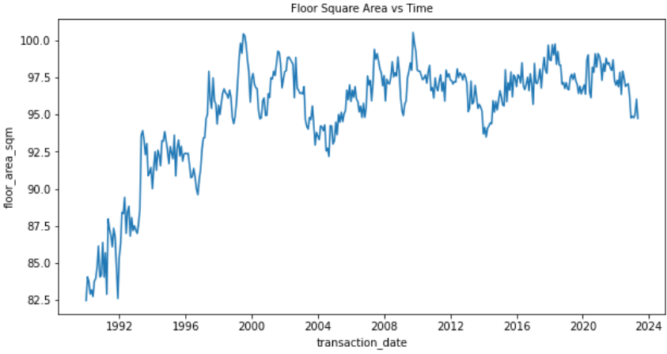

Observations:
1. It is observed that there is a there was a trend of floor square area increasing from 1990s to 2000. From there, the house sizes are seen to be fluctuating around 97.5 to 95 square area. 
2. This shows that the general sizes of resale houses are bigger as compared to resale houses in 1990s. This indicates that it is not necessary to buy old resale houses as they are bigger.

### Countplot: Count Of Flat Model

Observations:
1. It is observed that most of the houses are built in model A, Improved and New Generation
2. This also indicates that the general population of houses are built in model A, Improved and New Generation.
3. Potential buyers should potentially lookout for these houses as it would mean that these houses would be hotter in demand since it is regularly sold and bought on the propert market.

### Countplot: Count Of Flat Type

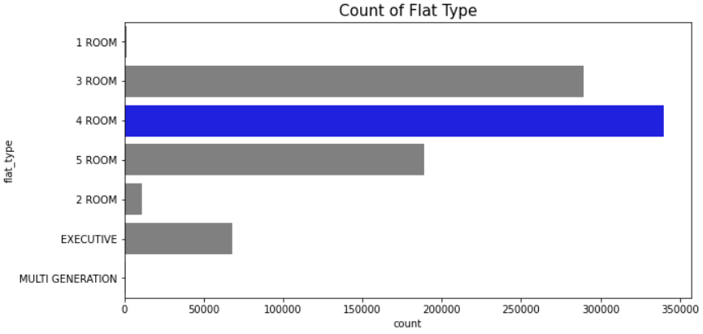

Observations:

1. This graph shows that most of the resale houses are generally 3 to 5 rooms. 
2. 4 rooms being the most common for resale flat.

### Countplot: Count Of Political Parties

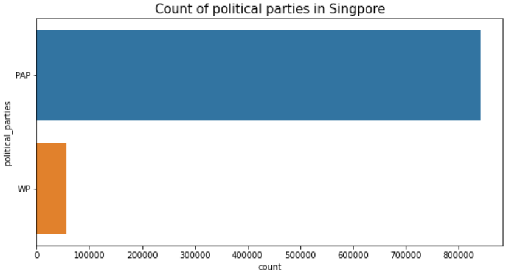

This observation shows that majority of the areas over the years in singapore are overseen by PAP. 

## Modeling

### Base Modeling - Linear Regression Model

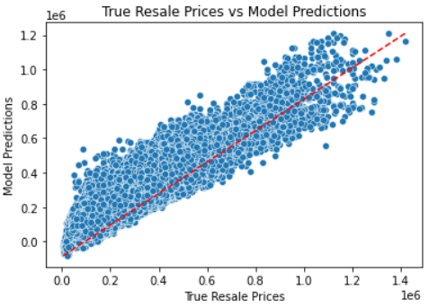

The graph above provides insights into the model's performance in predicting housing prices. The presence of a linear trend suggests a general relationship between the predicted and true values.

Upon closer examination, it can be observed that the majority of the data points are consistently positioned above the diagonal line. This indicates the presence of a systematic bias in the model's predictions. The bias suggests that the model tends to consistently overestimate or underestimate the true values, leading to a consistent deviation from the ideal linear relationship.

Furthermore, the scatter of data points around the diagonal line suggests a certain degree of prediction error. The loosely scattered points indicate a relatively higher level of variability or uncertainty in the model's predictions. This suggests that the model may have limitations in accurately capturing the true housing prices, leading to a higher degree of prediction error.

#### Discussions 

After fitting a linear regression model on the dataset, obtaining a train score and test score of 83.6% suggests that the model performs reasonably well on both the training and test data. The matching scores indicate that there is no apparent sign of overfitting or underfitting, which is generally desirable and the RMSE score is 65,976.

However, the cross-validation score of -6.05e+22 indicates a significant issue. This negative score strongly suggests the presence of model overfitting. Overfitting occurs when the model becomes too complex and starts capturing noise or irrelevant patterns from the training data. Consequently, it performs poorly on unseen data during cross-validation, resulting in a negative mean score.

The negative cross-validation score highlights the bad generalization of the model. It implies that the model's ability to accurately predict new, unseen data is severely compromised due to its overfitting behavior.

In addition, with the graph of true resale prices vs predicted prices, it is evident that the model can be improved predictive accuracy and reduce systematic bias in the model's predictions.

Given these findings, it is necessary to explore alternative models or techniques to improve both the train and test scores while addressing the issue of overfitting. This may involve adjusting model hyperparameters and trying different algorithms altogether. The goal is to enhance the model's generalization ability, ensuring that it can make accurate predictions on new data beyond the training set.

### Ridge CV

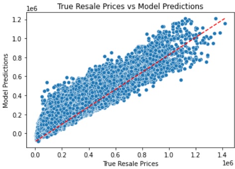

The observation of a systematic bias in the predicted values against the true values indicates that the model, similar to the base model, consistently deviates from the ideal linear relationship. This bias suggests that the model has a tendency to either overestimate or underestimate the true values consistently. This could be a result of various factors such as the model's underlying assumptions or limitations in capturing the complexity of the data.

Furthermore, the scatter of data points around the diagonal line indicates the presence of prediction error. The scattered distribution of points suggests that there is a degree of variability or uncertainty in the model's predictions. The prediction error could stem from various sources, including the model's inability to capture all relevant features or the presence of unaccounted-for noise in the data.

#### Observations

Hyperparameter tuning was conducted on the RidgeCV model, resulting in a train score and test score both standing at 83.6%. This parity suggests that the model is not suffering from overfitting or underfitting issues. However, upon evaluating the root mean squared error (RMSE) score of the tuned RidgeCV model, it was found to be slightly higher than that of the base model, measuring at 66,036. Consequently, it can be concluded that although the model's fitting appears to be satisfactory, there is still room for improvement in terms of predictive accuracy. The R^2 scores and RMSE scores can be further enhanced through additional experimentation and refinement of the model's hyperparameters, potentially leading to a more accurate and precise model for the given task.

### Lasso CV

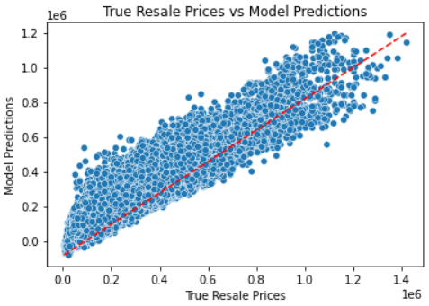

Similar to the base model, there are still observation of systematic bias and uncertainty of model predictions.

#### Observations

In the context of hyperparameter tuning on LassoCV, it was observed that both the train and test scores yielded the same value of 83.6%. This equality suggests that the model is neither suffering from overfitting nor underfitting, indicating a balanced performance. However, when examining the root mean squared error (RMSE) score, it was found to be similar to the RMSE score obtained from RidgeCV, without notable improvement. While the model's performance can be deemed satisfactory, it suggests that alternative models could be explored to achieve better results in terms of the R^2 score and a lower RMSE score. By considering other models or fine-tuning the existing one, it may be possible to enhance the predictive accuracy and precision, potentially leading to improved performance in the given task.

### Elastic Net

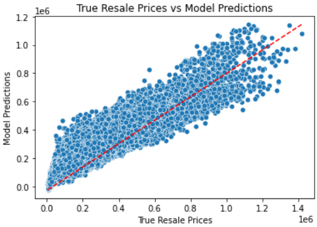

It is observed that there is still some form of systematic bias in the predicted values against true values. In addition, there is indication of large scatter in data points. This indicates presense of prediction error.

#### Observations

Upon employing ElasticNetCV, the train score and test score were determined to be 81.5% and 81.6% respectively. This suggests that the model is exhibiting a balanced performance without any notable signs of overfitting or underfitting. However, when assessing the root mean squared error (RMSE) score, it was found to be 70,043, which indicates a higher level of error compared to the other models previously evaluated. Consequently, it can be concluded that the ElasticNetCV model is underperforming in comparison to the previously employed models. This outcome indicates that further exploration and investigation may be necessary to improve the model's predictive accuracy and decrease the RMSE score. Alternative models could be explored to potentially enhance the model's performance in the given task.

### Neural Network

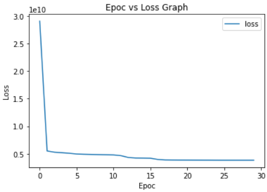

The observed graph of the training loss as training progresses provides valuable insights into the performance and convergence of the model. The significant dip in loss after the second epoch indicates that the model quickly started to learn and improve its predictions. This initial improvement is often observed as the model adjusts its parameters to better fit the training data.

Furthermore, after the second epoch, the loss continues to decrease gradually and reaches a plateau state from the 15th epoch onwards. This plateau suggests that the model has converged to a stable solution, where further training epochs do not result in significant improvements in reducing the loss. This indicates that the model has learned as much as it can from the available training data.

The consistent decrease and plateauing of the loss indicate that there is no sign of overfitting or underfitting of the model. Overfitting occurs when the model becomes too complex and starts to memorize the training data, resulting in poor generalization to new data. Underfitting, on the other hand, occurs when the model is too simple to capture the underlying patterns in the data. The low loss values achieved suggest that the model has found an appropriate level of complexity and is performing well in capturing the patterns in the training data.

Overall, the observed graph indicates that the model is performing effectively and has reached a stable state with low training loss. This suggests that the model is well-suited for the given task and demonstrates its ability to make accurate predictions without overfitting or underfitting.

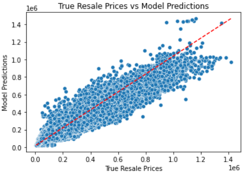

The observed scatter of data points evenly distributed both above and below the diagonal line suggests a lack of systematic bias in the model's predictions. The absence of a consistent overestimation or underestimation of true values indicates that the model does not exhibit a strong bias towards any particular direction.

However, despite the lack of systematic bias, the fact that the data points are still widely scattered around the diagonal line indicates a high degree of prediction error. The scattered distribution suggests that the model struggles to accurately predict the true values and exhibits a significant level of variability in its predictions. This high prediction error implies that the model may not be effectively capturing the underlying patterns and relationships within the data.

#### Observations

Upon exploring the neural network model, it was discovered that both the train and test scores achieved an impressive 99.9%. At first glance, this suggests that the model is capable of capturing and understanding the underlying patterns and trends within the training and test data, thus achieving a high level of performance. However, despite the high scores, the root mean squared error (RMSE) score stands at 61,779, indicating the presence of overfitting.

The high R-squared scores indicate that the model can explain a large portion of the variance in the target variable, which is a positive aspect. However, the high RMSE score implies that, on average, the model's predictions exhibit significant errors compared to the true values. This discrepancy indicates a lack of accuracy and a substantial amount of residual error between the predicted values and the actual observations.

In light of these findings, it becomes evident that the model's performance needs improvement, especially when considering its ability to generalize to unseen data. Therefore, exploring techniques like boosting could be a promising approach to enhance the model's performance and mitigate the overfitting issue. By applying boosting algorithms, such as AdaBoost or Gradient Boosting, the model's ability to generalize and make accurate predictions on new, unseen data can be improved, potentially reducing both the RMSE score and the overfitting problem.

### XG Boost

The observed even spread of data points above and below the diagonal line in the plot indicates that there is a relatively low systematic bias in the model's predictions. When the data points are evenly distributed on both sides of the diagonal line, it suggests that the model does not consistently overestimate or underestimate the true values. This balanced distribution implies that the model's predictions are generally unbiased and not skewed towards any particular direction.

Moreover, the close clustering of data points around the diagonal line suggests that the model's predictions are relatively accurate. When the data points are tightly grouped around the diagonal line, it indicates that the predicted values are closer to the true values. This indicates a good level of agreement between the model's predictions and the actual observed values.

#### Observations

Upon conducting hyperparameter tuning on XGBoost, it is evident that the train and test R-squared scores remain consistently high, at 98.2% and 98.4% respectively. Although these scores are lower compared to the neural network model's R-squared score of 99.9%, a notable advantage of XGBoost lies in its significantly lower root mean squared error (RMSE) scores. With an RMSE score of 21,592, XGBoost outperforms the neural network model's RMSE score of 61,779.

The lower RMSE score indicates that the XGBoost model is more accurate in predicting resale house pricing, with an average prediction error range of approximately ±21,592. This discrepancy in RMSE scores indicates that XGBoost is not suffering from overfitting or underfitting, making it a strong candidate for selecting a model to predict house prices. Despite the slightly lower R-squared scores compared to the neural network, the combination of high R-squared scores and low RMSE scores reinforces the effectiveness and reliability of the XGBoost model for accurate price predictions in the resale housing market.

## Main Discussion

| Model                     | Train R-squared (%) | Test R-squared (%) | RMSE   |
|:-------------------------:|:-------------------:|:------------------:|:------:|
| Linear Regression         | 83.6                | 83.6               | 65,976 |
| RidgeCV (Tuned)           | 83.6                | 83.6               | 66,036 |
| LassoCV (Tuned)           | 83.6                | 83.6               | 66,060 |
| ElasticNetCV (Tuned)      | 81.5                | 81.6               | 70,043 |
| Neural Network            | 99.9                | 99.9               | 61,779 |
| XGBoost (Tuned)           | 98.2                | 98.4               | 21,592 |

Based on the provided table, it is evident that XGBoost outperforms other models with hyperparameter tuning in terms of both the R-squared score and RMSE. XGBoost demonstrates the highest R-squared score and the lowest RMSE score among the models considered.

Comparing XGBoost to the base model, which is linear regression, the improvement in performance is striking. XGBoost exhibits an 18% increase in the R-squared score, indicating a better ability to explain the variance in the resale house prices compared to linear regression. Additionally, the RMSE score decreases by 32.7% when using XGBoost, indicating a substantial reduction in the average prediction error range.

Considering the significant improvement in both the R-squared score and RMSE, it is reasonable to select XGBoost as the chosen model for predicting resale house prices. XGBoost demonstrates superior predictive power and provides more accurate and precise predictions compared to the base model and other models with hyperparameter tuning.

## Future Works

For future work aimed at improving model predictions, several avenues can be explored. Firstly, with increased computational power, incorporating additional features could enhance the predictive performance. For instance, considering factors like the types of nearby malls or schools in relation to the resale house, as well as factors such as the number of sunshine hours and the direction the sunlight faces the house, could provide valuable insights. Furthermore, introducing additional feature engineering techniques, such as incorporating the distance to various amenities, might contribute to more accurate predictions.

Moreover, considering the temporal nature of the data, incorporating time series models could be a promising direction for improvement. Comparing the performance of XGBoost with other time series models, such as ARIMA or LSTM, would allow for a thorough evaluation of XGBoost's effectiveness in capturing and predicting temporal patterns in resale house prices.

Overall, by expanding the set of features and considering alternative modeling techniques, future research endeavors can strive to further enhance the predictive capabilities of the model, potentially leading to more accurate and robust predictions for resale house pricing.

## Conclusion

In conclusion, the analysis of resale house price prediction has revealed the superiority of the XGBoost model in terms of its predictive performance. With its high R-squared scores and low RMSE score, the XGBoost model demonstrates its ability to capture the underlying patterns and accurately predict resale house prices. By utilizing this model, stakeholders in the housing market can make more informed decisions, whether they are buyers looking for affordable options or sellers determining the optimal pricing strategy.

However, it is important to acknowledge that the prediction of housing prices is a complex task influenced by numerous factors beyond the scope of this analysis. Future research could explore additional features and data sources to further enhance the accuracy and robustness of the models. Furthermore, incorporating external factors such as economic indicators, policy changes, and market trends could provide a more comprehensive understanding of housing price dynamics.

Overall, the utilization of advanced machine learning models, such as XGBoost, in resale house price prediction offers significant potential for improving decision-making processes and fostering a more transparent and efficient housing market. By leveraging the power of data and sophisticated modeling techniques, stakeholders can navigate the challenges of the housing market with greater confidence and optimize their outcomes.