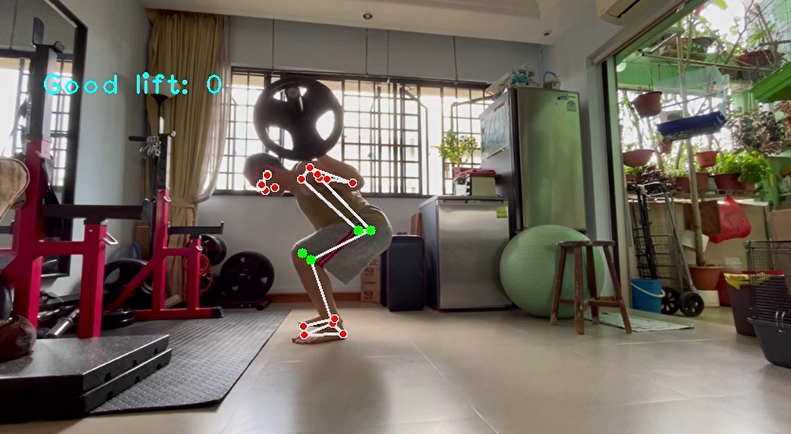
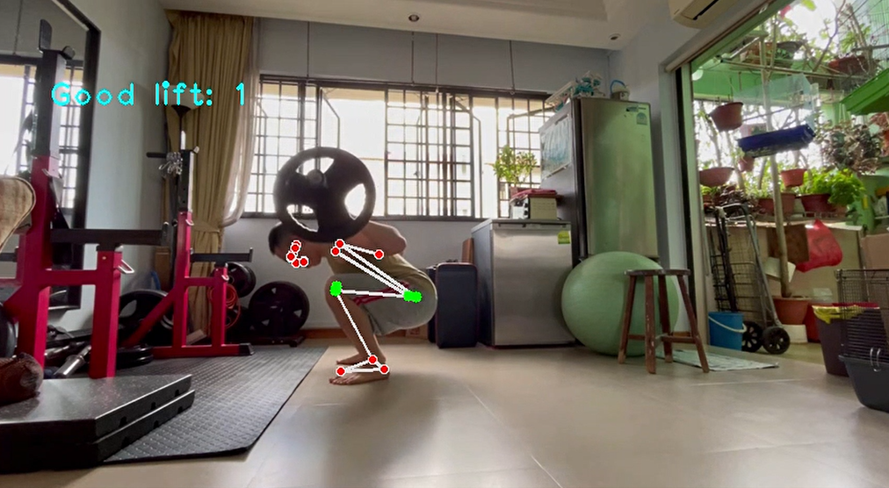

# Revolutionizing Rep Counting: Enhancing Squat Performance in Powerlifting Competitions through Computer Vision

## Preface

Powerlifting, a sport that tests an athlete's strength through three fundamental lifts - squat, bench press, and deadlift, embodies the pursuit of maximum weight lifting. This project focuses specifically on the squat exercise, which plays a pivotal role in powerlifting competitions.

According to [britanncia](https://www.britannica.com/sports/powerlifting#ref857046), a proper squat involves the lifter's thighs dropping to or below parallel with the ground. However, during competitions, the squat's execution is subject to the interpretation of three judges, each following guidelines outlined in the rulebook. This subjective judgment often leads to disagreements between powerlifters and judges regarding the depth of their squats. These disputes can potentially affect a lifter's chances of securing a spot on the podium, emphasizing the need for a more objective and accurate evaluation system.

As seen from the above image, a good squat is a squat counted when the lifter thighs goes below the horizontal line.

In light of this challenge, our project aims to introduce a groundbreaking solution: harnessing the power of computer vision to count squat reps reliably and precisely. By leveraging advanced image processing algorithms and machine learning techniques, we seek to develop a cutting-edge system that provides an unbiased and consistent evaluation of squat depth during powerlifting competitions.

Through this innovative approach, we aspire to eliminate the contentious debate surrounding squat depth and empower powerlifters with an objective measure of their performance. By enhancing the fairness and accuracy of judging, our computer vision-based rep counting system promises to revolutionize the powerlifting landscape and propel athletes towards their podium dreams.

## Aim

The primary objective of this project is to tackle the issue of human bias in squat lift evaluation, ultimately fostering a sense of fairness in powerlifting competitions. By harnessing the power of computer vision technology, our aim is to develop an innovative system that eradicates subjective judgments and ensures an impartial assessment of squat depth.

By implementing this technology, powerlifters will have access to a reliable tool that helps them train effectively for competitions while adhering to the correct depth requirements specified in the rule book. This enables them to fine-tune their technique, optimize their performance, and confidently present their skills on the competition platform.

## Computer Vision Program

As seen from the image captured when the lifter did not achieve sufficent depth, the lift will not be counted.

On the other hand, a lift is captured when the lifter has achieve sufficent depth. This program follows the guideline as mentioned by [britanncia](https://www.britannica.com/sports/powerlifting#ref857046) squat definition.

## Future Works

In future endeavors, this program can be expanded to incorporate additional lifts such as Deadlifts and Bench Press, further enhancing its versatility and utility for powerlifters. By integrating these lifts into the existing computer vision system, athletes will have a comprehensive tool at their disposal to evaluate and improve their performance across multiple exercises, promoting overall strength and technique development.

Additionally, exploring different camera angles holds great potential for advancing the accuracy and effectiveness of form assessment within the program. By capturing lifters from various perspectives, such as side angles or overhead views, a more comprehensive understanding of their form can be obtained. This would enable the system to provide more precise feedback and analysis, ensuring that users are not only adhering to depth requirements but also executing the lifts with optimal technique and alignment.

Moreover, future works could involve the integration of advanced machine learning algorithms and artificial intelligence techniques. This would enable the program to adapt and learn from individual lifters, providing personalized recommendations and corrective measures tailored to each user's specific needs. Such advancements would facilitate a more tailored and effective training experience, maximizing the potential for strength gains and reducing the risk of injury.

Furthermore, the scalability of the program could be explored, allowing it to be used beyond individual training sessions. This could involve incorporating the program into virtual coaching platforms or integrating it into live competitions, providing real-time feedback to both athletes and judges. By expanding its reach and application, the program would continue to revolutionize the powerlifting landscape, enhancing fairness, objectivity, and the overall quality of the sport.

## Conclusion

In conclusion, this project has successfully accomplished its objective of revolutionizing squat lift evaluation in powerlifting competitions. By harnessing the power of computer vision, we have introduced a groundbreaking solution that eliminates bias and ensures a fair assessment of squat depth. This transformative technology enables powerlifting competitions to leverage computer vision algorithms to track and evaluate squat lifts accurately, removing any human subjectivity that may have previously influenced judgments.

Moreover, this project has empowered powerlifters with a valuable tool to track their lifting form and ensure adherence to the correct depth requirements established by the organization. By utilizing this program, powerlifters can now receive real-time feedback and analysis of their squat technique, facilitating continuous improvement and enhancing their training regimen for optimal performance.

The successful achievement of these project objectives marks a significant milestone in the field of powerlifting. The implementation of computer vision technology has not only improved the fairness and integrity of competitions but also provided powerlifters with a tangible means to monitor and refine their lifting technique. This advancement contributes to a more standardized and objective evaluation system, fostering a level playing field for all participants.

In conclusion, through the successful completion of this project, we have laid the foundation for a more equitable, accurate, and inclusive powerlifting environment. By embracing computer vision, we have brought objectivity and precision to squat lift evaluation, empowering both powerlifters and competitions alike. The positive outcomes achieved through this endeavor will undoubtedly contribute to the continued growth and evolution of the sport, enhancing the experiences of athletes and elevating powerlifting to new heights of excellence.

## Final Note

Do check out the full video on this [link](https://drive.google.com/file/d/1Q9MojaDPBIZS4p01j0CGFTfZqc8NoEH8/view?usp=sharing).